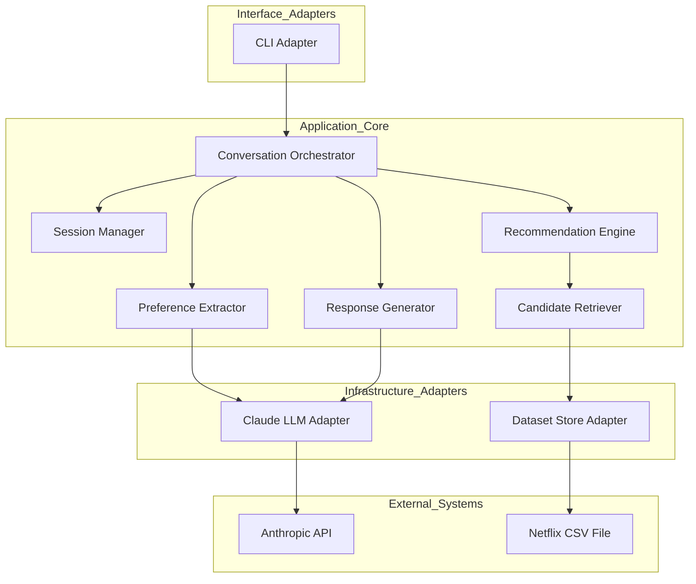
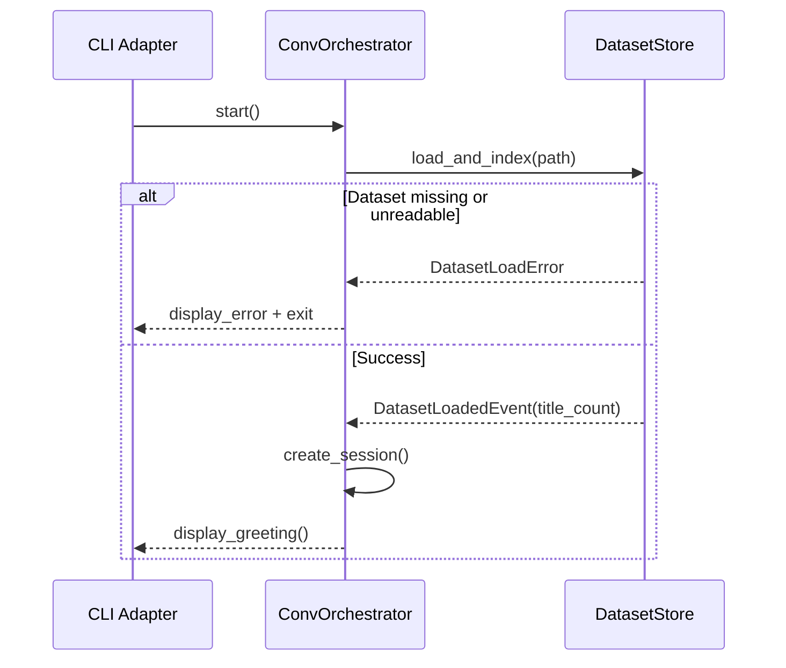
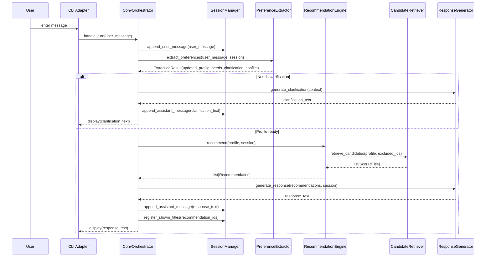
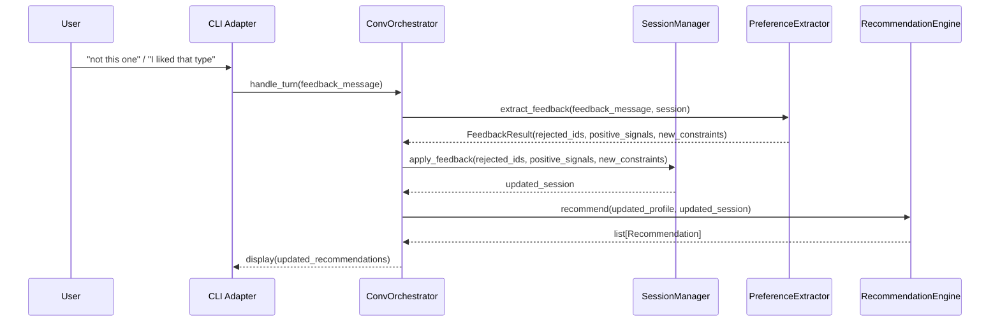

# Design Document — Netflix Content Recommender

## Overview

The Netflix Content Recommender is a conversational AI application that acts as a content sommelier: it accepts natural-language preference descriptions from the user, queries a locally loaded Netflix catalog dataset, and returns ranked title recommendations with personalized rationale. The system is built around a hybrid retrieval pipeline — structured Pandas filtering followed by TF-IDF semantic similarity — orchestrated by Claude LLM calls for preference extraction and response generation.

**Purpose**: Reduce content decision fatigue by delivering contextually relevant Netflix title recommendations through a multi-turn conversational CLI interface.

**Users**: End users browsing the Netflix catalog who wish to discover titles that match their current mood, taste, or explicit instructions, without navigating structured menus.

### Goals
- Parse free-text user preferences into structured signals and map them to real dataset titles.
- Maintain a session-scoped preference profile that accumulates and refines across conversation turns.
- Return grounded recommendations exclusively from the loaded dataset — no hallucinated titles.
- Deliver responses within 5 seconds under normal operating conditions.

### Non-Goals
- Persistent user accounts, cross-session preference history, or recommendation learning across sessions.
- Integration with the actual Netflix API or real-time catalog synchronization.
- A web or mobile UI (CLI adapter only at MVP; architecture supports future adapter swap).
- Collaborative filtering or user-similarity-based recommendations.
- Embedding-based semantic search (deferred; TF-IDF is sufficient at MVP scale — see `research.md`).

---

## Requirements Traceability

| Requirement | Summary | Components | Interfaces | Flows |
|-------------|---------|------------|------------|-------|
| 1.1 | Parse NL query into preference signals | PreferenceExtractor | LLMPort | Preference Extraction Flow |
| 1.2 | Ask clarifying question for ambiguous input | ConversationOrchestrator | — | Recommendation Turn Flow |
| 1.3 | Detect and resolve conflicting preferences | PreferenceExtractor | LLMPort | Preference Extraction Flow |
| 1.4 | Accept free-text at any turn | ConversationOrchestrator | — | Recommendation Turn Flow |
| 2.1 | Return 3–10 ranked suggestions | RecommendationEngine | RecommendationEnginePort | Recommendation Turn Flow |
| 2.2 | Include title, type, year, genres, rationale | ResponseGenerator | LLMPort | Recommendation Turn Flow |
| 2.3 | Filter by content type on request | CandidateRetriever | DatasetPort | Recommendation Turn Flow |
| 2.4 | No repeated titles in session | SessionManager | — | — |
| 2.5 | Rank by estimated relevance | CandidateRetriever, RecommendationEngine | — | — |
| 3.1 | Load and index dataset at startup | DatasetStore | DatasetPort | Startup Flow |
| 3.2 | No hallucinated titles | CandidateRetriever | DatasetPort | Recommendation Turn Flow |
| 3.3 | Error on missing/unreadable dataset | DatasetStore | — | Startup Flow |
| 3.4 | Filter by type, genre, year, rating, country | DatasetStore | DatasetPort | — |
| 4.1 | Remove rejected titles, return alternatives | SessionManager, RecommendationEngine | — | Feedback Flow |
| 4.2 | Weight positive feedback in future queries | PreferenceExtractor, SessionManager | — | Feedback Flow |
| 4.3 | Apply follow-up constraints without losing prior signals | SessionManager | — | Feedback Flow |
| 4.4 | Maintain session-scoped PreferenceProfile | SessionManager | — | — |
| 5.1 | Multi-turn context within session | SessionManager | — | — |
| 5.2 | Greet user and prompt for preferences | ConversationOrchestrator | — | Session Start Flow |
| 5.3 | Answer title questions from dataset metadata | ConversationOrchestrator, DatasetStore | DatasetPort | — |
| 5.4 | Inform user when title not in catalog | ConversationOrchestrator | DatasetPort | — |
| 5.5 | Respond in user's language | ResponseGenerator | LLMPort | — |
| 6.1 | Restrict results to maturity preference | DatasetStore, SessionManager | DatasetPort | — |
| 6.2 | Enforce maturity ceiling for session | SessionManager | — | — |
| 6.3 | Inform user when no results match combined filters | RecommendationEngine | — | — |
| 7.1 | Respond within 5 seconds | All components | — | — |
| 7.2 | Graceful error on internal failure | ConversationOrchestrator | — | — |
| 7.3 | Handle 10,000-title dataset within SLA | DatasetStore, CandidateRetriever | — | — |

---

## Architecture

### Architecture Pattern & Boundary Map

**Selected Pattern**: Hexagonal (Ports & Adapters)

The application has three external actors: the CLI user (driving actor), the LLM provider (driven actor), and the Netflix CSV dataset (driven resource). Hexagonal architecture models each as a port with a concrete adapter, isolating the domain core from infrastructure concerns. See `research.md` for the evaluation of alternative patterns.



**Architecture Integration**:
- Selected pattern: Hexagonal — clean isolation of domain from LLM and dataset adapters; supports future UI adapter swap (1.4, 5.1).
- Domain boundary: `Application_Core` owns all business logic; `Infrastructure_Adapters` own all I/O.
- `LLMPort` and `DatasetPort` are the two driven ports; `ConversationPort` is the driving port.
- New components rationale: all components are new (greenfield); each has a single, non-overlapping responsibility.
- Steering compliance: no existing steering; hexagonal is consistent with standard clean-architecture principles.

### Technology Stack

| Layer | Choice / Version | Role in Feature | Notes |
|-------|------------------|-----------------|-------|
| Runtime | Python 3.11+ | Application language | Best AI/data ecosystem; type hints enforced throughout |
| LLM Provider | Anthropic SDK (`anthropic` ≥ 0.47) | Preference extraction, response generation | Two-model strategy: Haiku for extraction, Sonnet for generation (see `research.md`) |
| LLM Models | `claude-haiku-4-5-20251001` / `claude-sonnet-4-6` | Extraction / Generation | Configurable via environment variable |
| Dataset I/O | `pandas` ≥ 2.1 | CSV loading, structured filtering, indexing | In-memory; loaded once at startup |
| Semantic Search | `scikit-learn` ≥ 1.4 (`TfidfVectorizer`, `cosine_similarity`) | Description-based relevance ranking | No embedding API needed at ≤10k titles (see `research.md`) |
| CLI Interface | `rich` ≥ 13.0 | Formatted terminal output, conversation display | Markdown rendering, panels, progress indicators |
| Configuration | `python-dotenv` ≥ 1.0 | API key and model config from `.env` | ANTHROPIC_API_KEY, model names |
| Testing | `pytest` ≥ 8.0, `pytest-mock` | Unit and integration tests | Domain core testable without LLM/dataset adapters |

---

## System Flows

### Startup Flow



### Recommendation Turn Flow



### Feedback Flow



**Key decisions**: Preference extraction and feedback extraction use the same `PreferenceExtractor` component with different prompt modes. The `SessionManager` is the single owner of mutable session state; all other components receive it as read input and return deltas.

---

## Components and Interfaces

### Component Summary

| Component | Layer | Intent | Req Coverage | Key Dependencies | Contracts |
|-----------|-------|--------|--------------|-----------------|-----------|
| DatasetStore | Infrastructure | Load, index, and filter Netflix CSV | 3.1, 3.2, 3.3, 3.4, 6.1 | pandas, scikit-learn | Service, State |
| PreferenceExtractor | Domain | Extract structured preference signals from free text | 1.1, 1.2, 1.3, 4.2, 4.3 | LLMPort | Service |
| CandidateRetriever | Domain | Filter + rank dataset candidates by preference profile | 2.3, 2.4, 2.5, 3.2 | DatasetPort | Service |
| RecommendationEngine | Application | Orchestrate retrieval pipeline and enforce session rules | 2.1, 2.4, 6.3 | CandidateRetriever, SessionManager | Service |
| SessionManager | Application | Own and mutate session state | 4.1, 4.2, 4.3, 4.4, 5.1, 6.2 | — | State |
| ResponseGenerator | Application | Generate formatted response text via LLM | 2.2, 5.3, 5.4, 5.5 | LLMPort | Service |
| ConversationOrchestrator | Application | Route turns, coordinate all components | 1.2, 1.4, 5.2, 7.1, 7.2 | All above | Service |
| CLIAdapter | Interface | Render conversation in terminal | — | ConversationPort, rich | — |
| ClaudeAdapter | Infrastructure | Implement LLMPort via Anthropic SDK | 1.1, 2.2, 5.5 | anthropic SDK | Service |

---

### Domain Layer

#### PreferenceExtractor

| Field | Detail |
|-------|--------|
| Intent | Parse a user message and session context into a structured `PreferenceProfile` delta using an LLM extraction call |
| Requirements | 1.1, 1.2, 1.3, 4.2, 4.3 |

**Responsibilities & Constraints**
- Issues a single LLM call (Haiku model) with a strict JSON-output system prompt to extract genre keywords, mood signals, content type preference, year range, maturity preference, and explicit title exclusions.
- Detects ambiguity (query too short, no extractable signals) and flags `needs_clarification`.
- Detects conflicting signals and flags `has_conflict` with a short conflict description.
- Does not mutate `Session`; returns a `PreferenceProfileDelta` that the `SessionManager` applies.

**Dependencies**
- Outbound: `LLMPort` — LLM extraction call (P0)
- Inbound: `ConversationOrchestrator` — invokes per turn (P0)

**Contracts**: Service [x]

##### Service Interface
```python
@dataclass
class PreferenceProfileDelta:
    genres: list[str]
    mood_keywords: list[str]
    content_type: str | None  # "Movie" | "TV Show" | None
    year_min: int | None
    year_max: int | None
    maturity_ceiling: str | None
    country_filter: str | None
    excluded_title_ids: list[str]
    positive_genre_signals: list[str]
    needs_clarification: bool
    clarification_hint: str | None
    has_conflict: bool
    conflict_description: str | None

class PreferenceExtractorPort(Protocol):
    def extract(
        self,
        user_message: str,
        session: Session,
        mode: Literal["preference", "feedback"],
    ) -> PreferenceProfileDelta: ...
```
- Preconditions: `user_message` is non-empty; `session.conversation_history` may be empty on first turn.
- Postconditions: Returns a valid `PreferenceProfileDelta`; if LLM returns malformed JSON, falls back to treating the raw message as keyword input with `needs_clarification=True`.
- Invariants: Never raises on LLM failure; always returns a delta (possibly empty with `needs_clarification=True`).

**Implementation Notes**
- Integration: LLM system prompt includes the JSON schema for `PreferenceProfileDelta`; response is parsed with `json.loads` inside a try/except with fallback.
- Validation: Validate extracted `maturity_ceiling` values against a fixed enum of known Netflix rating strings.
- Risks: LLM output instability for very short inputs; mitigated by fallback and clarification path.

---

#### CandidateRetriever

| Field | Detail |
|-------|--------|
| Intent | Apply structured Pandas filters then TF-IDF cosine similarity to return a ranked list of candidate titles from the dataset |
| Requirements | 2.3, 2.4, 2.5, 3.2 |

**Responsibilities & Constraints**
- Applies boolean mask filters on the `DatasetStore` index (type, genre, year range, rating, country) based on the `PreferenceProfile`.
- Constructs a query string from the profile's `mood_keywords` and `genres` and computes cosine similarity against the TF-IDF index of title descriptions.
- Excludes `seen_title_ids` from `Session` before returning candidates (requirement 2.4).
- Returns at most `max_candidates` results (configurable, default 20) for the `RecommendationEngine` to further trim to 3–10.

**Dependencies**
- Outbound: `DatasetPort` — filtered dataset access (P0)
- Inbound: `RecommendationEngine` (P0)

**Contracts**: Service [x]

##### Service Interface
```python
@dataclass
class ScoredTitle:
    title: NetflixTitle
    similarity_score: float  # 0.0–1.0

class CandidateRetrieverPort(Protocol):
    def retrieve(
        self,
        profile: PreferenceProfile,
        excluded_ids: frozenset[str],
        max_candidates: int = 20,
    ) -> list[ScoredTitle]: ...
```
- Preconditions: `DatasetStore` must be loaded (checked at startup — never called if not).
- Postconditions: All returned `NetflixTitle` objects have `show_id` not in `excluded_ids`; list is sorted descending by `similarity_score`.
- Invariants: If zero candidates survive filtering, returns an empty list (not an error).

**Implementation Notes**
- Integration: TF-IDF matrix is built once at `DatasetStore` initialization; `CandidateRetriever` receives a reference to the fitted vectorizer and matrix.
- Validation: If `profile` has no extractable keywords, fall back to a random sample of filtered titles with `similarity_score=0.0`.
- Risks: Low TF-IDF quality for abstract mood queries; mitigated by the upstream LLM extraction converting mood to genre keywords.

---

### Application Layer

#### SessionManager

| Field | Detail |
|-------|--------|
| Intent | Own all mutable session state: conversation history, preference profile, and shown title registry |
| Requirements | 4.1, 4.2, 4.3, 4.4, 5.1, 6.2 |

**Responsibilities & Constraints**
- Sole writer of `Session` state; all other components receive `Session` as a read-only input.
- Applies `PreferenceProfileDelta` by merging new signals into the existing `PreferenceProfile` (additive, not replacement).
- Manages `seen_title_ids` set: adds IDs after each recommendation round.
- Enforces `max_history_turns` truncation to cap conversation history size sent to the LLM.

**Contracts**: State [x]

##### State Management
```python
@dataclass
class PreferenceProfile:
    genres: list[str]
    mood_keywords: list[str]
    content_type: str | None
    year_min: int | None
    year_max: int | None
    maturity_ceiling: str | None
    country_filter: str | None
    positive_genre_signals: list[str]

@dataclass
class Message:
    role: Literal["user", "assistant"]
    content: str

@dataclass
class Session:
    id: str
    conversation_history: list[Message]
    preference_profile: PreferenceProfile
    seen_title_ids: frozenset[str]
    maturity_ceiling_locked: bool  # True when set via parental control mode (req 6.2)

class SessionManagerPort(Protocol):
    def create_session(self) -> Session: ...
    def append_message(self, session: Session, role: Literal["user", "assistant"], content: str) -> Session: ...
    def apply_delta(self, session: Session, delta: PreferenceProfileDelta) -> Session: ...
    def register_shown_titles(self, session: Session, title_ids: list[str]) -> Session: ...
    def apply_rejected_titles(self, session: Session, rejected_ids: list[str]) -> Session: ...
    def lock_maturity_ceiling(self, session: Session, ceiling: str) -> Session: ...
```
- State model: Immutable update pattern — each method returns a new `Session` instance (avoids shared-state bugs).
- Persistence: In-memory only; no cross-session persistence (out of scope).
- Concurrency: Single-threaded CLI; no concurrency concerns at MVP.

---

#### RecommendationEngine

| Field | Detail |
|-------|--------|
| Intent | Orchestrate the retrieval pipeline and enforce result count and empty-result business rules |
| Requirements | 2.1, 2.4, 6.3 |

**Responsibilities & Constraints**
- Calls `CandidateRetriever` with the current `PreferenceProfile` and `seen_title_ids`.
- Trims result list to between 3 and 10 items (requirement 2.1).
- If the result list is empty after filtering, returns a `NoResultsResult` with a reason (requirement 6.3).

**Contracts**: Service [x]

##### Service Interface
```python
@dataclass
class Recommendation:
    title: NetflixTitle
    relevance_score: float
    rationale: str  # Populated by ResponseGenerator; empty at this stage

@dataclass
class NoResultsResult:
    reason: Literal["no_matching_titles", "all_seen"]
    suggestion: str  # e.g., "Try relaxing the maturity filter"

RecommendationOutput = list[Recommendation] | NoResultsResult

class RecommendationEnginePort(Protocol):
    def recommend(
        self,
        profile: PreferenceProfile,
        session: Session,
    ) -> RecommendationOutput: ...
```

---

#### ResponseGenerator

| Field | Detail |
|-------|--------|
| Intent | Use the LLM (Sonnet model) to generate natural-language recommendation text with per-title rationale, handle title detail questions, and enforce multilingual response |
| Requirements | 2.2, 5.3, 5.4, 5.5 |

**Responsibilities & Constraints**
- Receives a list of `Recommendation` objects and populates the `rationale` field for each via a single batched LLM call.
- Formats the final response string for the CLI, including title metadata.
- For title detail questions (req 5.3), queries `DatasetStore` for the description and passes it to the LLM for a concise answer.
- Instructs the LLM to respond in the same language as the last user message (req 5.5).

**Dependencies**
- Outbound: `LLMPort` — response generation call with Sonnet (P0)
- Outbound: `DatasetPort` — title detail lookup (P1)
- Inbound: `ConversationOrchestrator` (P0)

**Contracts**: Service [x]

##### Service Interface
```python
class ResponseGeneratorPort(Protocol):
    def generate_recommendations_response(
        self,
        recommendations: list[Recommendation],
        session: Session,
        user_language: str,
    ) -> str: ...

    def generate_clarification(
        self,
        hint: str,
        session: Session,
        user_language: str,
    ) -> str: ...

    def generate_title_detail_response(
        self,
        title: NetflixTitle,
        user_question: str,
        user_language: str,
    ) -> str: ...

    def generate_no_results_response(
        self,
        result: NoResultsResult,
        user_language: str,
    ) -> str: ...
```

---

#### ConversationOrchestrator

| Field | Detail |
|-------|--------|
| Intent | Route each user turn to the correct processing path, enforce the 5-second SLA, and handle all recoverable errors |
| Requirements | 1.2, 1.4, 5.2, 7.1, 7.2 |

**Responsibilities & Constraints**
- Entry point for all user input; coordinates `PreferenceExtractor`, `RecommendationEngine`, `SessionManager`, and `ResponseGenerator`.
- Detects turn intent: recommendation request, feedback/refinement, title detail question, or off-topic.
- Wraps all LLM and retrieval calls in a timeout guard (5-second deadline); on timeout, returns a user-friendly retry prompt.
- On session start, emits a greeting message (req 5.2).

**Contracts**: Service [x]

##### Service Interface
```python
class ConversationOrchestratorPort(Protocol):
    def start_session(self) -> tuple[Session, str]: ...
    """Returns (session, greeting_message)"""

    def handle_turn(
        self,
        user_message: str,
        session: Session,
    ) -> tuple[Session, str]: ...
    """Returns (updated_session, assistant_response)"""
```

---

### Infrastructure Layer

#### DatasetStore

| Field | Detail |
|-------|--------|
| Intent | Load the Netflix CSV, normalize fields, build the TF-IDF index, and expose typed filtering and lookup operations |
| Requirements | 3.1, 3.2, 3.3, 3.4, 6.1, 7.3 |

**Responsibilities & Constraints**
- Loads CSV at startup; raises `DatasetLoadError` if file is missing or malformed.
- Normalizes `listed_in` into `list[str]`, `date_added` into `datetime | None`, `duration` into `DurationInfo`.
- Builds `TfidfVectorizer` fitted on concatenated `title + description` strings.
- Exposes a typed `filter()` method returning a list of matching `NetflixTitle` objects.
- Exposes a `tfidf_similarity(query: str, candidates: list[NetflixTitle]) -> list[ScoredTitle]` method.

**Dependencies**
- External: `pandas` ≥ 2.1 — CSV loading and boolean mask filtering (P0)
- External: `scikit-learn` ≥ 1.4 — TF-IDF vectorization and cosine similarity (P0)

**Contracts**: Service [x] / State [x]

##### Service Interface
```python
@dataclass
class DurationInfo:
    value: int
    unit: Literal["min", "Seasons"]

@dataclass
class NetflixTitle:
    show_id: str
    type: Literal["Movie", "TV Show"]
    title: str
    director: str | None
    cast: list[str]
    country: str | None
    release_year: int
    rating: str | None
    duration: DurationInfo | None
    genres: list[str]
    description: str

@dataclass
class DatasetFilter:
    content_type: Literal["Movie", "TV Show"] | None = None
    genres: list[str] | None = None
    year_min: int | None = None
    year_max: int | None = None
    maturity_ceiling: str | None = None
    country: str | None = None

class DatasetPort(Protocol):
    def filter(self, criteria: DatasetFilter) -> list[NetflixTitle]: ...
    def get_by_id(self, show_id: str) -> NetflixTitle | None: ...
    def tfidf_similarity(self, query: str, candidates: list[NetflixTitle]) -> list[ScoredTitle]: ...
    def title_count(self) -> int: ...
```
- Preconditions: `load_and_index(path)` must complete successfully before any other method is called.
- Postconditions: `filter()` never returns titles outside the loaded corpus; `tfidf_similarity()` preserves input list order on tie.
- Invariants: Dataset is read-only; no mutation after initial load.

**Implementation Notes**
- Integration: `DatasetStore` is instantiated once and injected into `CandidateRetriever` and `ResponseGenerator` via constructor.
- Validation: Null-safe access on all nullable fields; genre filter uses `any(g in title.genres for g in filter_genres)` (case-insensitive).
- Risks: Malformed CSV rows; mitigated by `errors='coerce'` in pandas read and row-level validation during normalization.

---

#### ClaudeAdapter

| Field | Detail |
|-------|--------|
| Intent | Implement `LLMPort` using the Anthropic Python SDK; manage message serialization and two-model dispatch |
| Requirements | 1.1, 2.2, 5.5 |

**Dependencies**
- External: `anthropic` SDK ≥ 0.47 — `client.messages.create()` (P0)
- External: Anthropic API (ANTHROPIC_API_KEY env var) (P0)

**Contracts**: Service [x]

##### Service Interface
```python
@dataclass
class LLMRequest:
    system_prompt: str
    messages: list[Message]
    model: Literal["extraction", "generation"]
    max_tokens: int
    temperature: float = 0.3

@dataclass
class LLMResponse:
    content: str
    input_tokens: int
    output_tokens: int

class LLMPort(Protocol):
    def complete(self, request: LLMRequest) -> LLMResponse: ...
```
- `model="extraction"` maps to `claude-haiku-4-5-20251001`; `model="generation"` maps to `claude-sonnet-4-6`.
- On `anthropic.APIError` or network timeout, raises `LLMUnavailableError` (caught by `ConversationOrchestrator`).

---

## Data Models

### Domain Model

```
PreferenceProfile ──────────── aggregates preference signals for a session
Session ──────────────────────── root aggregate: owns history, profile, seen IDs
NetflixTitle ─────────────────── value object (immutable, from dataset)
Recommendation ──────────────── value object: NetflixTitle + relevance + rationale
Message ──────────────────────── value object: role + content
```

Business invariants:
- A `Session`'s `seen_title_ids` is append-only.
- `PreferenceProfile.maturity_ceiling` cannot be raised once `maturity_ceiling_locked=True` in the session.
- A `Recommendation.title.show_id` must exist in the loaded `DatasetStore`.

### Logical Data Model

**NetflixTitle** (value object, from CSV):
- `show_id: str` — natural key
- `type: "Movie" | "TV Show"` — content type discriminator
- `genres: list[str]` — normalized from `listed_in`
- `release_year: int`, `rating: str | None`, `country: str | None`
- `description: str` — primary field for TF-IDF similarity

**Session** (in-memory aggregate, per-session lifecycle):
- `id: str` — UUID, for logging
- `conversation_history: list[Message]` — capped at `max_history_turns` (default 20)
- `preference_profile: PreferenceProfile` — accumulated across turns
- `seen_title_ids: frozenset[str]` — titles already shown in session

### Data Contracts & Integration

**LLM Extraction Request** (system prompt schema instruction):
```json
{
  "genres": ["string"],
  "mood_keywords": ["string"],
  "content_type": "Movie | TV Show | null",
  "year_min": "integer | null",
  "year_max": "integer | null",
  "maturity_ceiling": "string | null",
  "country_filter": "string | null",
  "excluded_title_ids": ["string"],
  "positive_genre_signals": ["string"],
  "needs_clarification": "boolean",
  "clarification_hint": "string | null",
  "has_conflict": "boolean",
  "conflict_description": "string | null"
}
```

**LLM Generation Request**: Full `conversation_history` + sommelier persona system prompt + list of candidate titles as structured context injected into the final user message.

---

## Error Handling

### Error Strategy
Fail-fast at startup (dataset load); graceful degradation at runtime (LLM failures return user-friendly retry messages; empty retrieval results return an informative response, not a crash).

### Error Categories and Responses

**Startup Errors**:
- `DatasetLoadError` (missing file, malformed CSV) → display error message with file path, exit with code 1 (req 3.3).

**LLM Errors** (`LLMUnavailableError`):
- Network timeout or API error → `ConversationOrchestrator` catches, displays "Something went wrong. Would you like to try again?" and returns control to CLI loop (req 7.2).

**Empty Results** (`NoResultsResult`):
- No titles match the combined filters → `ResponseGenerator` produces a natural-language explanation suggesting which constraint to relax (req 6.3).

**Malformed LLM JSON** (extraction fallback):
- `json.loads` fails → treat raw user message as keyword input, set `needs_clarification=True`.

### Monitoring
- All LLM calls log: model name, `input_tokens`, `output_tokens`, latency_ms (to stderr or a configurable log file).
- Startup log: dataset path, title count loaded, TF-IDF index build time.
- No external monitoring infrastructure required at MVP.

---

## Testing Strategy

### Unit Tests
- `PreferenceExtractor`: mock `LLMPort`; verify correct `PreferenceProfileDelta` parsing for valid JSON, malformed JSON (fallback), ambiguous input, and conflicting signals.
- `CandidateRetriever`: use an in-memory `DatasetStore` with a 20-title fixture; verify filtering correctness and `seen_title_ids` exclusion.
- `SessionManager`: verify immutable update semantics; verify `maturity_ceiling_locked` enforcement; verify `seen_title_ids` accumulation.
- `DatasetStore`: load from a 10-row fixture CSV; verify normalization of `listed_in`, null handling, `DatasetLoadError` on missing file.

### Integration Tests
- Full turn cycle: `ConversationOrchestrator` with real `DatasetStore` fixture and mocked `LLMPort`; verify a user query produces a valid `Recommendation` list within the 3–10 range.
- Feedback cycle: two-turn conversation with rejection feedback; verify rejected title does not appear in second round.
- Maturity filter: locked maturity ceiling with a preference that matches only higher-rated titles; verify `NoResultsResult` is returned.

### E2E Tests
- CLI smoke test: launch CLI with a small dataset fixture, send a typed query, verify terminal output contains a recommendation block.

### Performance Tests
- Load `DatasetStore` with 10,000-row fixture; measure `filter()` + `tfidf_similarity()` combined latency; assert < 500 ms (leaving budget for two LLM calls within the 5-second total SLA).

---

## Security Considerations

- `ANTHROPIC_API_KEY` must be loaded from environment variable or `.env` file; never hardcoded or logged.
- The Netflix CSV file path is provided via configuration, not user input — no path traversal risk.
- LLM outputs are displayed as-is in the terminal (no HTML rendering); no XSS surface.

## Performance & Scalability

- **Target**: End-to-end response < 5 seconds (req 7.1); retrieval pipeline (Pandas filter + TF-IDF) < 500 ms; LLM extraction call (Haiku) < 1.5 s; LLM generation call (Sonnet) < 3 s.
- **History truncation**: `max_history_turns=20` caps the token count of `messages` sent per API call, bounding latency growth over long sessions.
- **Scale limit**: Design is intentionally scoped to ≤10,000 titles in-process. Scaling beyond this requires an embedding-based retrieval layer (documented in `research.md` as a future enhancement).
